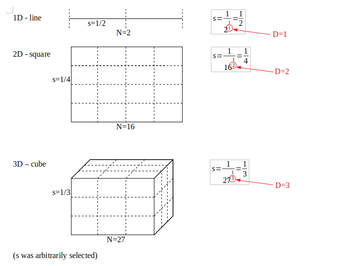
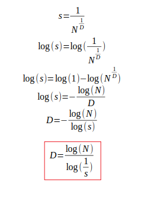
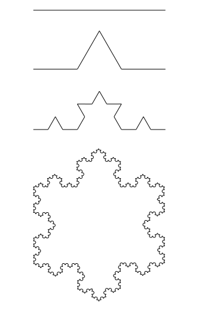
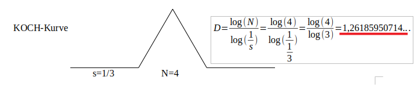
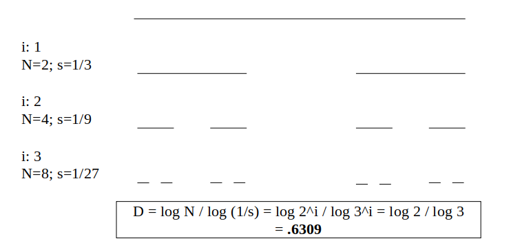
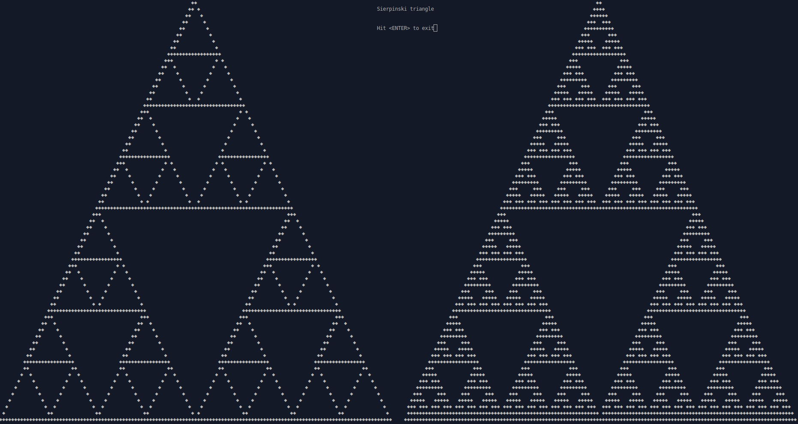

# Fractal dimension

This article gives a brief overview of Fractal dimension calculation also known as Self-similarity dimension starting with the Geometric dimension of Euclidean objects and then develop further to fractals. The text only covers the very basics of this complex topic.

## Calculation of the Euclidean dimension

Geometric dimension `D` of standard euclidean objects:

* Line: `D = 1`
* Square: `D = 2`
* Cube: `D = 3`

This is intuitive but let's see how they are _actually_ calculated.

Each object is divided into smaller, self-similar parts.
Analysing the relation between the scale factor and the number of self-similar parts reveals the value for the Geometric dimension.

The equation from above solved for the dimension `D`.

It can be observed that `D` doesn't always have to be an integer. `D` is called the Fractal dimension.

## Fractal dimensions can be rational numbers

This equation can be used to calculate the dimension of the famous KOCH-curve.
The KOCH-curve is constructed by dividing each segment in three parts and replacing the middle part with two parts.
If repeating this step and connecting the line endings a nice looking KOCH-snowflake is the result.

The scale factor of the KOCH-curve is 3 (`s = 1/3`) and the number of self-similar parts is 4 (`N = 4`).

Interestingly the value for the dimension is between 1 and 2.
The next figure gives an example for a dimension smaller than 1, the famous CANTOR-set:

## Historical background

Lewis Fry Richardson found a regularity between the length of national boundaries and scale size.
It was Benoit Mandelbrot who discovered the fractal dimension in the work of Richardson.

## Capacity Dimension and outlook

There are other very important Dimension terms defined in mathematics:

* Box dimension
* Hausdorff dimension
* Capacity dimension

For example, the Hausdorff dimension and the Capacity dimension for the discussed KOCH-curve and the CANTOR-set are equal to the Fractal dimension. There may be other cases where this is not true.

Some examples for the Capacity dimension `d_c`:

1) The rational numbers in `[0, 1]: d_c = 1`
1) `A = {0, 1/2, 1/4, 1/8, 1/16, ...}: d_c = 0`
1) `B = {0, 1, 1/2, 1/3, ...}: d_c = 1/2`

On the other hand the Hausdorff dimension in the first and third example is `0`.

Substantial mathematical knowledge is required to calculate these results.

## Computer graphics of Fractals

The following screenshot shows two **Sierpinski triangles** with different recursion steps.

The program to draw the figure is available [here](https://github.com/n3xus6/ncurses-examples/blob/master/sierpinski.c).

## References

* _Taschenbuch der Mathematik, Bronstein, ISBN 3-8171-2006-0_
* _The fractal geometry of nature, Benoit B. Mandelbrot, ISBN 0-7167-1186-9_
* [Fractal Geometry, Yale University](https://users.math.yale.edu/public_html/People/frame/Fractals/)
* [Mathematical Problem Solving with Computers](http://www.math.stonybrook.edu/~scott/Book331/Fractal_Dimension.html)
